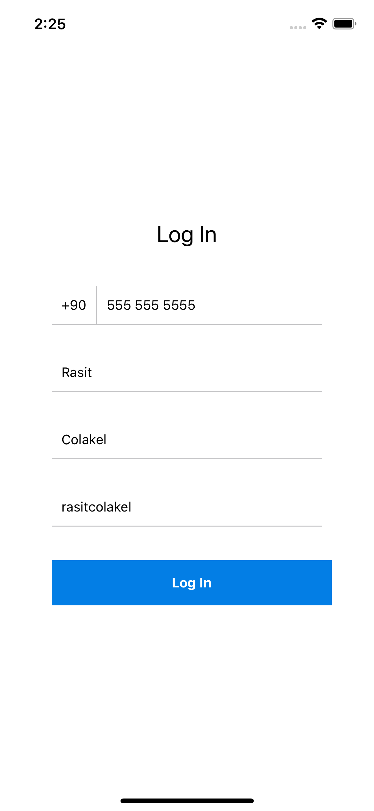
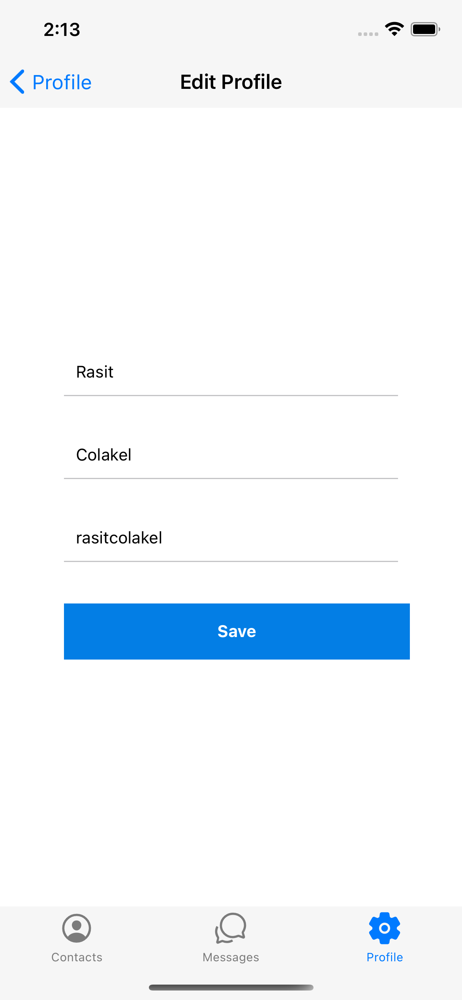
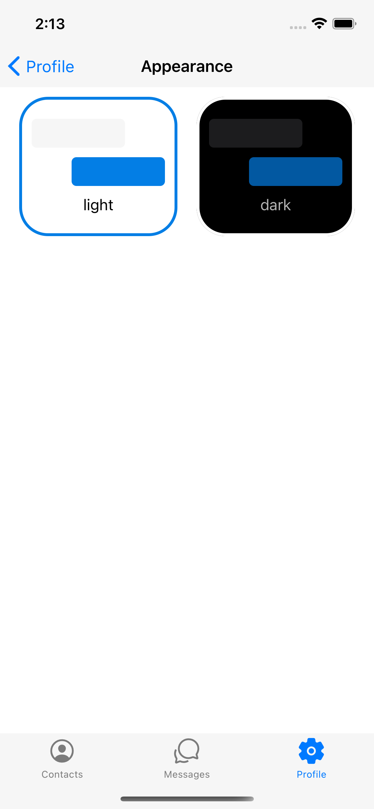
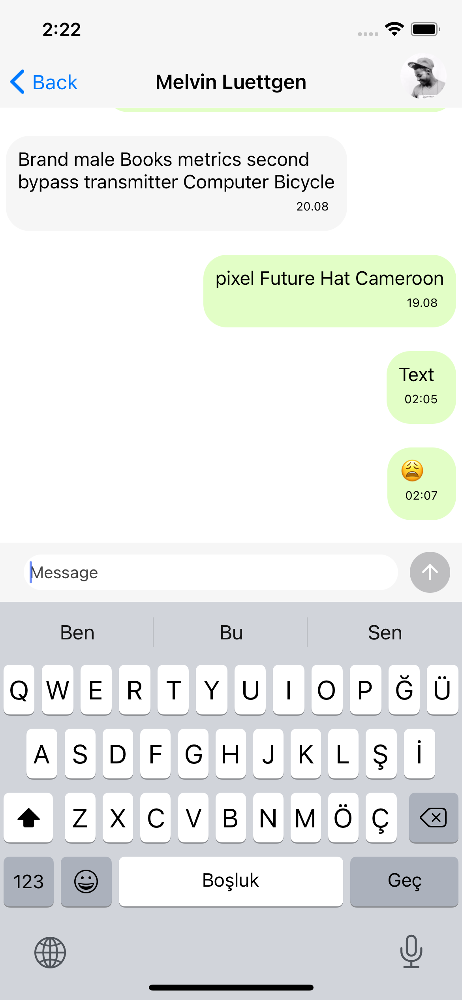
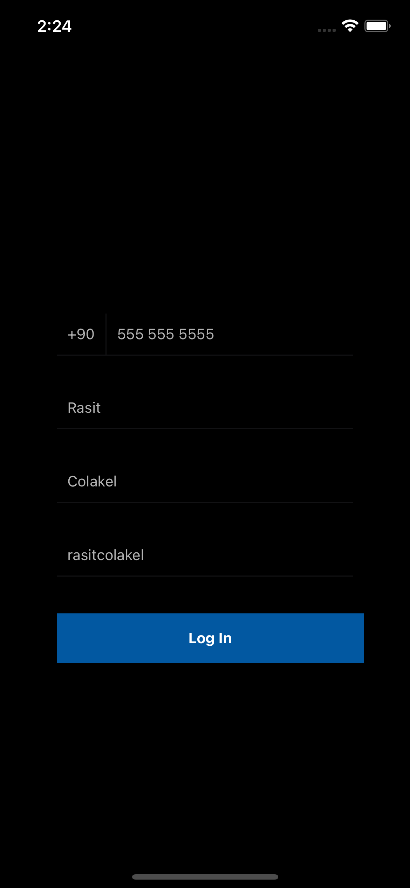
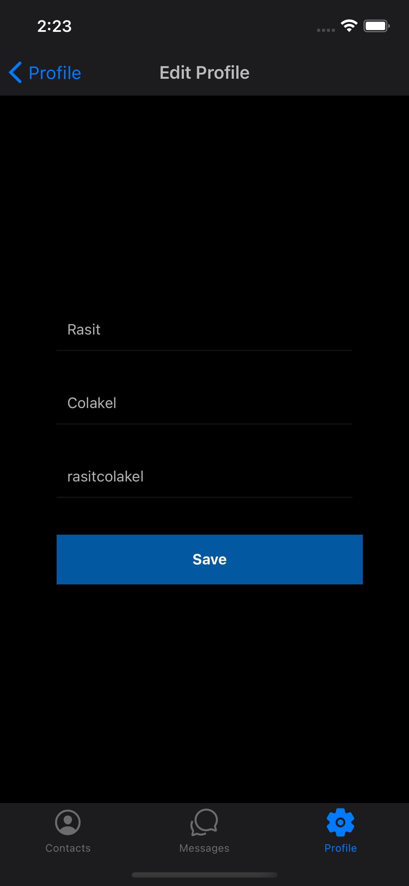
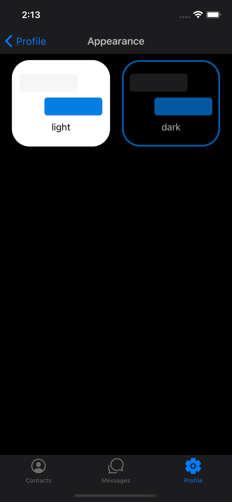
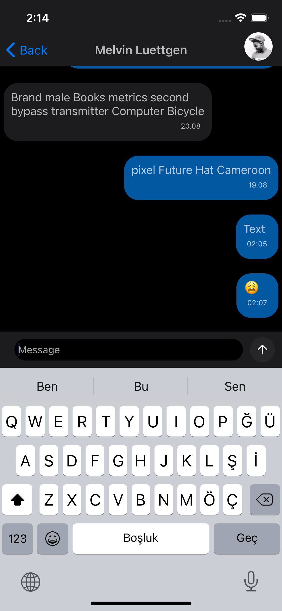

[](https://classroom.github.com/online_ide?assignment_repo_id=8293902&assignment_repo_type=AssignmentRepo)

### Assignment: [Assignment 3]

## React Native Async Storage Usage
Async storage is used to store data in the device.

### getItem

```js
async function getItem(key) {
  try {
    const value = await AsyncStorage.getItem(key);
    if (value !== null) {
      // We have data!!
      return value;
    }
  } catch (error) {
    // Error retrieving data
  }
}
```

### setItem

```js
async function setItem(key, value) {
  try {
    await AsyncStorage.setItem(key, value);
  } catch (error) {
    // Error saving data
  }
}
```

### removeItem

```js
async function removeItem(key) {
  try {
    await AsyncStorage.removeItem(key);
  } catch (error) {
    // Error removing data
  }
}
```

## How to use AsyncStorage in React Native

Async storage is used to store data in the device.

### setItem

```js
async function setItem(key, value) {
  try {
    await AsyncStorage.setItem(key, value);
  } catch (error) {
    // Error saving data
  }
}
```

### getItem

```js
async function getItem(key) {
  try {
    const value = await AsyncStorage.getItem(key);
    if (value !== null) {
      // We have data!!
      return value;
    }
  } catch (error) {
    // Error retrieving data
  }
}
```

### removeItem

```js
async function removeItem(key) {
  try {
    await AsyncStorage.removeItem(key);
  } catch (error) {
    // Error removing data
  }
}
```

## React Native Fast Image Usage

It is used to load images from the internet.

## FastImage

```js
import FastImage from 'react-native-fast-image';

FastImage.preload([
  {uri: 'https://facebook.github.io/react-native/img/tiny_logo.png'},
  {uri: 'https://facebook.github.io/react-native/img/tiny_logo.png'},
]);
```

## FastImage

```js
import FastImage from 'react-native-fast-image';

<FastImage
  source={{
    uri: 'https://facebook.github.io/react-native/img/tiny_logo.png',
    priority: FastImage.priority.normal,
  }}
  style={{ width: 50, height: 50 }}
```

## Moment.js

Moment is used to format dates.

```js
import moment from 'moment';

moment().format();
```

# ScreenShots (Light Theme)









# ScreenShots (Dark Theme)









# Preview


